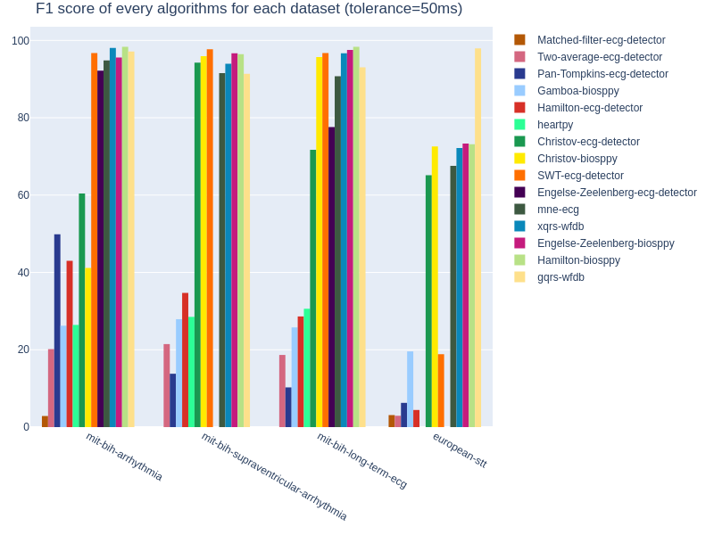
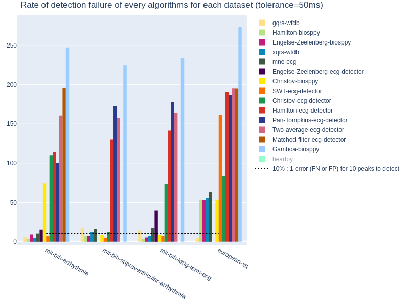
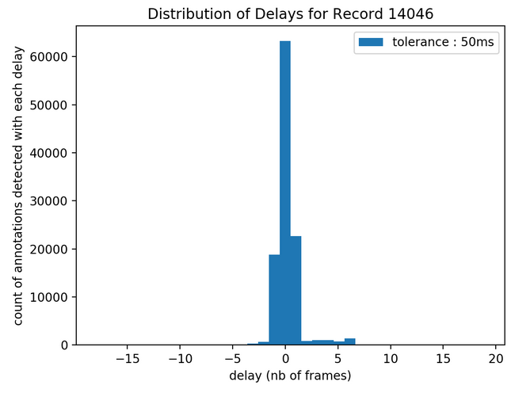
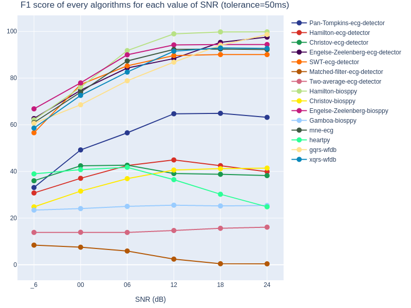
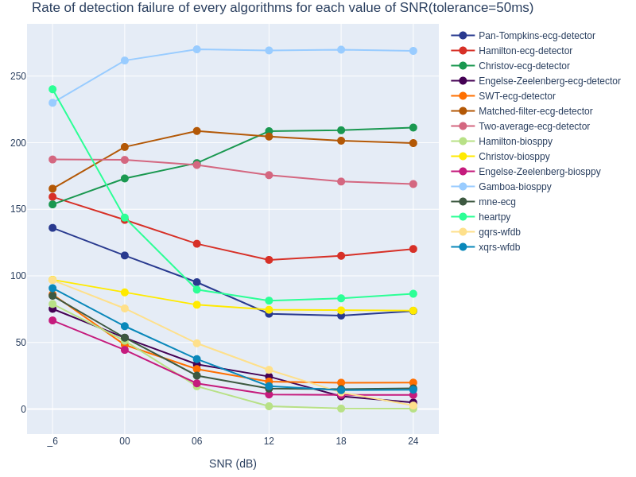

# QRS Detector Benchmark

This project aims to perform a benchmark of existing open source QRS detector tools.

The objective is to compare different algorithms from open source libraries:
- [py-ecg-detectors](https://github.com/berndporr/py-ecg-detectors)
- [biosppy](https://github.com/PIA-Group/BioSPPy)
- [mne](https://github.com/mne-tools/mne-python)
- [heartpy](https://github.com/paulvangentcom/heartrate_analysis_python)
- [wfdb](https://github.com/MIT-LCP/wfdb-python)

The benchmark is based on six databases which can be found on Physionet with full descriptions:
- [MIT BIH Arrhythmia Database](https://physionet.org/content/mitdb/1.0.0/)
- [MIT BIH Noise stress test Database](https://physionet.org/content/nstdb/1.0.0/)
- [European STT Database](https://physionet.org/content/edb/1.0.0/)
- [MIT BIH Supraventricular Arrhythmia Database](https://physionet.org/content/svdb/1.0.0/)
- [MIT BIH Long Term ECG Database](https://physionet.org/content/ltdb/1.0.0/)

Databases on Physionet are classified into three different classes according to specified criteria:  
    Class 1 - completed reference databases.  
    Class 2 - archival copies of raw data that support published research, contributed by authors or journals.  
    Class 3 - other contributed collections of data, including works in progress.   
    
In the list above, the three first databases belong to the first class and the last two ones belong to class 3.

This study was undertaken as part of [Aura Healthcare](https://www.aura.healthcare) project, with the help of [OCTO Technology](https://www.octo.com/fr).

## Installation/Prerequisites

#### Download Data

As mentioned, you can download the content of the databases on Physionet. Please create a data folder at the root of the project with a folder for each database inside, such as _(data/name_of_database)_. For example, data/mit-bih-long-term-ecg-database.

#### Dependencies

To use the benchmark some libraries are required:  
(Python==3.7.6)  
biosppy>=0.6.1  
Click>=7.0  
heartpy>=1.2.6  
matplotlib>=3.1.3  
mne>=0.20.5  
numpy>=1.18.1  
pandas>=1.0.1  
plotly>=4.5.0  
py-ecg-detectors>=1.0.2  
streamlit>=0.56.0  
wfdb>=2.2.1  

You can install dependencies from the terminal with the command:

```
pip install requirements.txt
```

## Usage

You can perform the evaluation through a Makefile command from the terminal:  
```
make evaluation DATASET='name_of_dataset' ALGO='name_of_algorithm' TOLERANCE=int_value
```  

Lists of available databases and algorithms are the following (but can be found thanks to the command **make help**):  
 > Datasets : **'mit-bih-arrhythmia', 'mit-bih-noise-stress-test-e24', 'mit-bih-noise-stress-test-e18', 'mit-bih-noise-stress-test-e12', 'mit-bih-noise-stress-test-e06', 'mit-bih-noise-stress-test, 'mit-bih-noise-stress-test-e_6', 'european-stt', 'mit-bih-supraventricular-arrhythmia','mit-bih-long-term-ecg'**
 
 > Algorithms : **'Pan-Tompkins-ecg-detector', 'Hamilton-ecg-detector', 'Christov-ecg-detector', 'Engelse-Zeelenberg-ecg-detector', 'SWT-ecg-detector', 'Matched-filter-ecg-detector', 'Two-average-ecg-detector', 'Hamilton-biosppy', 'Christov-biosppy', 'Engelse-Zeelenberg-biosppy', 'Gamboa-biosppy', 'mne-ecg', 'heartpy', 'gqrs-wfdb', 'xqrs-wfdb'**
 
**Tolerance** is an integer value, which represents the admissible delay's time **(in milliseconds)** before and after an annotation to consider a detection as correct. Every time you perform the evaluation of performances (of an algorithm on a dataset with a chosen tolerance), two additional evaluations with tolerances by default (25 and 50 ms) are also achieved.

Seven criteria and scores are calculated and saved to compare performances. You can get them for each record but also for the whole dataset:

> **False Positives (FP)** : number of detections which don't correspond to an annotated peak R (may be also too early or too late according to the tolerance)
 
> **False Negatives (FN)** : number of forgotten annotated peak R (may be also too early or too late according to the tolerance)

> **Detection Failure (F)** : sum of false positives and false negatives

> **Rate of detection Failure (F%)** : percentage of detection failure in comparison with total number of annotated peaks R
 
> **Positive Predictivity (P%)** : percentage of correct detections in comparison with total number of detections
 
> **Sensibility (Se%)** : percentage of correct detections in comparison with total number of annotated peaks R 
 
> **F1-score (F1%)** : percentage of the harmonic mean of the positive predictivity and sensibility of the algorithm

You can display results of evaluation on a streamlit dashboard. To launch it, you can use the following command from the terminal:
```
make viz
```
A new window will open on your web browser.


#### Applications of the dashboard

The dashboard consist of 3 different applications, that you can choose with the sidebar at the left.


**Comparison of performances of some algorithms on a dataset** :  
You can select thanks to the lists and the checkboxes, which algorithms you would like to compare on one dataset with a chosen tolerance.  
A global comparative table will show performances of each algorithm on the whole selected dataset.  

Here, an example with performances of every algorithms on MIT BIH arrhythmia database, with a tolerance of 50ms:  
  

Summary graphs of performances according to two criteria (F1-score and rate of detection failure) are given for every evaluations (combinations algorithm-dataset) performed for a tolerance of 50ms.  


  

**Complete evaluation of an algorithm on a dataset** :  
You can select thanks to the lists the evaluation (combination algorithm-dataset), which you would like to have more information about.  
Detailed tables with performances for each record of the dataset will be displayed.  

Here, an example with the Hamilton method from Biosppy library for MIT BIH long term ecg with a tolerance of 50ms:  
  

Histograms represent the repartition of delays (time between a correct detection in comparison with its corresponding annotated R peak) in a record you can select among the database.  

Here, an example with the Hamilton method from Biosppy library for the record 14046 from MIT BIH long term ecg, with a tolerance of 50ms:  
  
    **/!\ Be careful** the delay is in "number of frames" instead of milliseconds. The correspondance depends on the sampling frequency : For example, the sampling frequency for the MIT BIH Arrhythmia Database is 360 Hz, it means there are 360 frames during a second of the record. Thus, if the delay is worth 18 frames, it corresponds to 0.05s (18x1:360) or 50ms.

**Comparison of performances of one algorithm for different Signal to Noise Ratios** or test of noise robustness :  
You can select thanks to the list an algorithm and a tolerance. The dataset used in this application is MIT BIH Noise Stress Database, which corresponds to the same two records (118/119 from MIT BIH Arrhythmia) with six additional noise levels. Please read Physionet description for more details about. SNR is the ratio of the power of the signal (here ECG) to the one of the background noise (here electrode motion artifact); for each record, the value of SNR is the measure on segments of the signal where the noise was added.  
Detailed tables with performances for each record and each SNR's value are given.

Here, an example with the Engelse-Zeelenberg method from Biosppy library for record 118 from MIT BIH arrhythmia and noise stress test databases, with a tolerance of 50ms:  
  

Summary graphs of performances according to two criteria (F1-score and rate of detection failure) are displayed for every evaluations (combinations algorithm-dataset(/SNR)) performed for a tolerance of 50ms.  


  


## License

This project is licensed under the *3-Clause BSD License* - see the [LICENSE.md]() file for details

## Acknowledgments

I would like to thank Marisa Faragi, Laurent Ribière and Clément Le Couedic who gave me time and precious help to develop this project.
