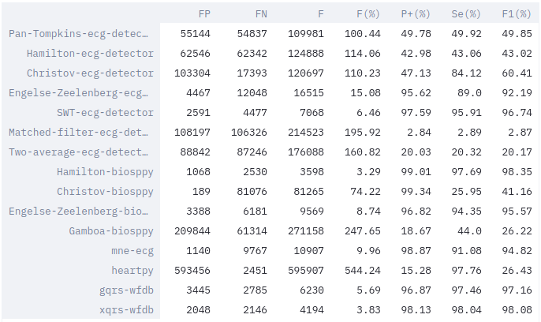
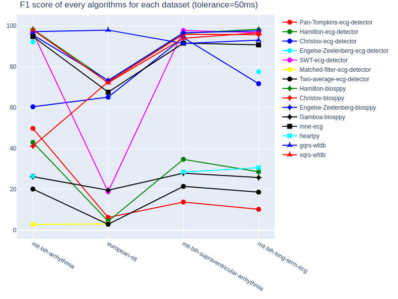
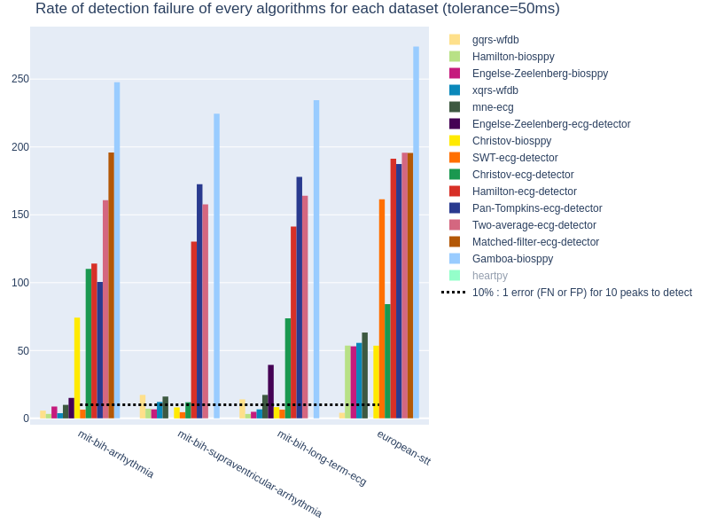
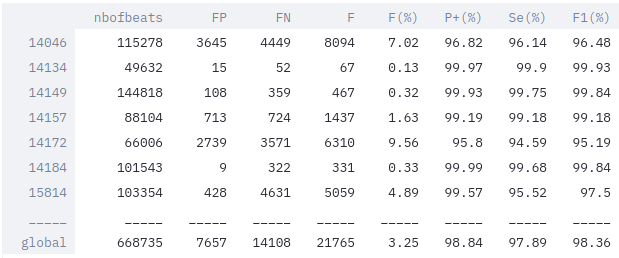
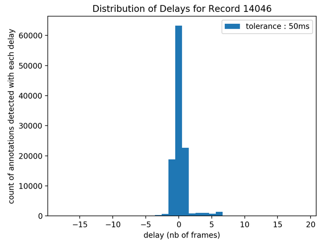
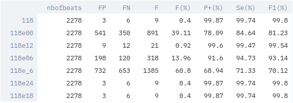
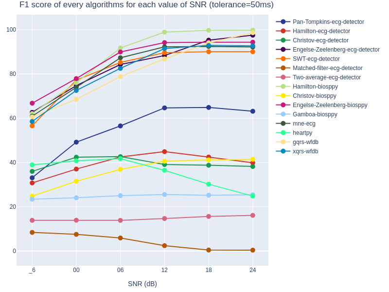
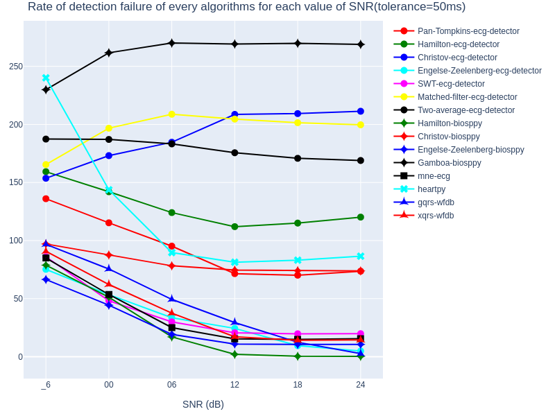

## Go Further

#### Applications of the dashboard

_ **Comparison of performances of some algorithms on a dataset** :  
You can select thanks to the lists and the checkboxes, which algorithms you would like to compare on one dataset with a chosen tolerance.  
A global comparative table will show performances of each algorithm on the whole selected dataset.  

Here, an example with performances of every algorithms on MIT BIH arrhythmia database, with a tolerance of 50ms:  
  

Summary graphs of performances according to two criteria (F1-score and rate of detection failure) are given for every evaluations (combinations algorithm-dataset) performed for a tolerance of 50ms.  

  

_ **Complete evaluation of an algorithm on a dataset** :  
You can select thanks to the lists the evaluation (combination algorithm-dataset), which you would like to have more information about.  
Detailed tables with performances for each record of the dataset will be displayed.  

Here, an example with the Hamilton method from Biosppy library for MIT BIH long term ecg with a tolerance of 50ms:  
  

Histograms represent the repartition of delays (time between a correct detection in comparison with its corresponding annotated R peak) in a record you can select among the database.  

Here, an example with the Hamilton method from Biosppy library for the record 14046 from MIT BIH long term ecg, with a tolerance of 50ms:  
   

**/!\ Be careful** the delay is in "number of frames" instead of milliseconds. The correspondance depends on the sampling frequency : For example, the sampling frequency for the MIT BIH Arrhythmia Database is 360 Hz, it means there are 360 frames during a second of the record. Thus, if the delay is worth 18 frames, it corresponds to 0.05s (18x1:360) or 50ms.

_ **Comparison of performances of one algorithm for different Signal to Noise Ratios** or test of noise robustness : 
 
You can select thanks to the list an algorithm and a tolerance. The dataset used in this application is MIT BIH Noise Stress Database, which corresponds to the same two records (118/119 from MIT BIH Arrhythmia) with six additional noise levels. Please read Physionet description for more details about. SNR is the ratio of the power of the signal (here ECG) to the one of the background noise (here electrode motion artifact); for each record, the value of SNR is the measure on segments of the signal where the noise was added.  
Detailed tables with performances for each record and each SNR's value are given.

Here, an example with the Engelse-Zeelenberg method from Biosppy library for record 118 from MIT BIH arrhythmia and noise stress test databases, with a tolerance of 50ms:  
  

Summary graphs of performances according to two criteria (F1-score and rate of detection failure) are displayed for every evaluations (combinations algorithm-dataset(/SNR)) performed for a tolerance of 50ms.  

  
